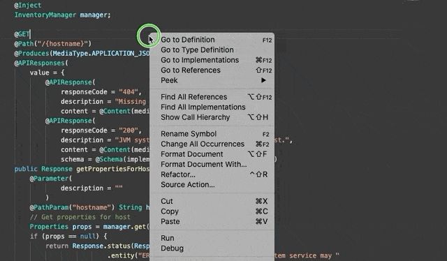

# MicroProfile Language Support for VS Code

Provides language support for MicroProfile specifications in Java files, making use of the [MicroProfile Language Server](https://github.com/MicroShed/microprofile-language-server).

## Installation
1. Download `vscode-microprofile-0.0.1.vsix` from the [releases page](https://github.com/MicroShed/microprofile-lsp-client-vscode/releases).
1. In VS Code, press Shift Command P to open the Command Palette 
1. Type `Extensions: Install from VSIX...` then press Enter
1. Navigate to and install `vscode-microprofile-0.0.1.vsix` 
1. Wait for a prompt at the bottom right of the screen to indicate that the extension has been installed. Click Reload Now on that prompt if indicated.

## Features

#### Diagnostic Warnings and Quick Fix
- **MP Health**: Annotations and interface implementation.
  - `@Liveness`/`@Readiness` annotation quick fixes
    
  - `implements HealthCheck` quick fix
    

- **MP Rest Client**: CDI injection annotations, Rest Client interface registration.
  - `@Inject` and/or `@RestClient` annotation quick fix
    
  - Diagnostic warning for interface being injected elsewhere but not registered as a Rest Client.
    

#### Code complete suggestions with additional info
- **MP Health**: Annotation code complete suggestions prioritized in list with additional info.
    

#### Source actions
- **MP OpenAPI**: Generate OpenAPI annotations via source action.
	- An `@Operation` annotation will be generated for any number of methods in a single class with a Response return type who do not already have an `@Operation` annotation.
    

#### Code snippets with fields that you can fill in
- **MP OpenAPI**: `@Operation` or `@Parameter` annotation code snippets

## Building from source
1. Clone [MicroProfile Language Server](https://github.com/MicroShed/microprofile-language-server)
1. Clone [MicroProfile Language Support for VS Code](https://github.com/MicroShed/microprofile-lsp-client-vscode)
1. From `microprofile-language-server` directory: `mvn clean package` to generate `microprofile-language-server-0.0.1-SNAPSHOT.jar`
1. From `microprofile-lsp-client-vscode` directory: `npm install`
1. Copy `microprofile-language-server/target/microprofile-language-server-0.0.1-SNAPSHOT.jar` to `microprofile-lsp-client-vscode/jars/` folder
1. From `microprofile-lsp-client-vscode` directory: `vsce package` to generate `vscode-microprofile-0.0.1.vsix`

